# Swift File Tools: Project Architecture & Structure Map

Welcome to the architectural map of **Swift File Tools**! This guide is designed to help any developer—from seasoned engineers to complete beginners—easily navigate and understand the entire codebase.

---

## 🌟 The Big Picture: How it Works

Swift File Tools is a **client-side first** application. This means 99% of the heavy lifting (converting PDFs, compressing videos, removing image backgrounds, running OCR) happens **directly in the user's web browser**. It does not upload files to a remote server for processing. This ensures maximum privacy, speed, and offline capability.

Here is a visual map showing how the different layers of the project talk to each other:

```mermaid
graph TD
    %% Styling
    classDef ui fill:#3b82f6,stroke:#1d4ed8,color:#fff,font-weight:bold;
    classDef js fill:#10b981,stroke:#047857,color:#fff,font-weight:bold;
    classDef lib fill:#f59e0b,stroke:#d97706,color:#fff,font-weight:bold;
    classDef db fill:#8b5cf6,stroke:#6d28d9,color:#fff,font-weight:bold;
    classDef back fill:#ef4444,stroke:#b91c1c,color:#fff,font-weight:bold;

    %% Elements
    UI[index.html <br> Presentation Layer: HTML + CSS]:::ui
    
    subgraph API [api/ - Javascript Modules]
        Utils[utils.js <br> Global States & Toast alerts]:::js
        Nav[navigation.js <br> Tabs & Search]:::js
        History[history.js <br> Database UI & Logger]:::js
        Assist[assistant.js <br> Chatbot & Speech & OCR]:::js
        PDFTools[pdf-tools.js <br> Compress/Redact/Merge]:::js
        ImgTools[image-tools.js <br> BG Remover & Collage]:::js
        Scan[scanner-tool.js <br> Camera & OpenCV warp]:::js
        VidComp[video-compressor.js <br> Canvas Recording & Audio]:::js
        OtherJS[Other Helper Modules <br> word-to-pdf, webpage-tools...]:::js
    end

    subgraph Libraries [External Libraries via CDNs]
        PDFLib[pdf-lib.js <br> PDF Assembly]:::lib
        PDFJS[pdf.js <br> PDF Reading/Rendering]:::lib
        Tess[tesseract.js <br> OCR Text Scanner]:::lib
        Mammoth[mammoth.js <br> Docx Parser]:::lib
        OpenCV[opencv.js <br> Edge Detection Matrix]:::lib
    end

    subgraph Storage [Browser Storage]
        IndexedDB[(IndexedDB <br> Local Files & Logs)]:::db
        LocStor[(Local Storage <br> User settings & API Keys)]:::db
    end

    subgraph Backend [Serverless Backend - Vercel API Proxies]
        BackChat[api/chat.js <br> Secure Groq AI Proxy]:::back
        BackSearch[api/search.js <br> Web Search API]:::back
        BackYt[server.js <br> Express local video scraper]:::back
    end

    %% Relationships
    UI -->|Loads| Utils
    UI -->|Loads| Nav
    UI -->|Imports| Libraries
    
    Utils -->|Shares Global State| API
    Nav -->|Switches Workspaces| UI
    History -->|Saves Job Logs| IndexedDB
    Assist -->|Reads Settings| LocStor
    Assist -->|Performs OCR| Tess
    Scan -->|Tracks Edges| OpenCV
    PDFTools -->|Assembles Documents| PDFLib
    PDFTools -->|Renders Pages| PDFJS
    
    Assist -->|Sends chat prompts| BackChat
    Assist -->|Queries keywords| BackSearch
    VidComp -->|Streams frames| PDFLib
    
    class UI,Utils,Nav,History,Assist,PDFTools,ImgTools,Scan,VidComp,OtherJS,PDFLib,PDFJS,Tess,Mammoth,OpenCV,IndexedDB,LocStor,BackChat,BackSearch,BackYt default;
```



---

## 📂 Project Directory Structure

Here is how the files are organized in the workspace folder:

```text
swiftfile-main/
│
├── api/                             # 🚀 JAVASCRIPT LOGIC DIRECTORY
│   ├── assistant.js                 # Controls chatbot agent, OCR, & Speech-to-text
│   ├── chat.js                      # Backend Serverless function: Groq API proxy
│   ├── history.js                   # Handles browser conversion history database (IndexedDB)
│   ├── image-tools.js               # Manages image collage, compression, & BG remover
│   ├── navigation.js                # Manages tabs, sidebar resizing, and search filtering
│   ├── pdf-helpers.js               # PDF compression, conversion, & standard security routines
│   ├── pdf-tools.js                 # PDF tools (split, merge, compress, protect, unlock, redact)
│   ├── scanner-tool.js              # Camera streaming, edge alignment, and warp crops
│   ├── scrape.js                    # Backend Serverless function: Webscraper helper
│   ├── search.js                    # Backend Serverless function: DuckDuckGo search API
│   ├── share-api.js                 # Listens to mobile "Share-to" native intent uploads
│   ├── utils.js                     # Global states, toast messages, and popup dialogs
│   ├── video-compressor.js          # Video compression engine & comparison canvas
│   ├── webpage-tools.js             # Renders webpage links to canvas conversions
│   ├── watermark-tool.js            # Stamps text/logos overlays on documents
│   ├── word-to-pdf.js               # Mammoth parser for Microsoft DOCX conversions
│   └── yt.js                        # Backend Serverless function: YouTube download metadata
│
├── index.html                       # 🎨 PRESENTATION LAYER (HTML structure & styling CSS)
├── logo.png                         # Application icon asset
├── manifest.json                    # PWA metadata (allows installing app on mobile & desktop)
├── sw.js                            # Service Worker (caches files for offline mode support)
├── package.json                     # Node.js backend configuration & packages
├── server.js                        # Local Express server (optional development backend)
├── vercel.json                      # Vercel deployment routing configuration
└── README.md                        # Basic project description
```

---

## 🛠️ File-by-File Breakdown

### 1. Front-End Core (The Visible Web Page)

| File | Skill Level | Role & Responsibility | What happens inside it? |
| :--- | :--- | :--- | :--- |
| **`index.html`** | *Beginner* | **HTML Skeleton + Layout Styling (CSS)** | Defines the structure of all 16 conversion panels (tabs) and styling configurations. It imports CDN script files for major engines (like Lucide Icons, Tesseract, mammoth) and loads the sequential scripts. |
| **`logo.png`** | *None* | **Asset** | The visual logo brand. |
| **`manifest.json`** | *Beginner* | **Mobile PWA Config** | Tells browsers this page is a Progressive Web App, enabling home-screen shortcut installs. |
| **`sw.js`** | *Intermediate* | **Service Worker** | Caches local scripts, stylesheets, and icons so that the app loads instantly, even when offline. |

---

### 2. Browser Logic Modules (`api/` folder - Frontend)

These files handle everything that executes when you click buttons on the page:

| Module JS File | Primary Purpose | Key Functions to Look For | How it interacts |
| :--- | :--- | :--- | :--- |
| **`utils.js`** | **Common Utilities & States** | `showStatus()`, `notify()`, `showCustomConfirm()`, `getBase64()` | Holds all state variables (e.g. active lists of pages, settings). Provides popup confirmation cards and warning toasts. Must be loaded first. |
| **`navigation.js`** | **UI Panel Transitions** | `switchTab()`, `toggleMobileMenu()`, `applyToolSearch()` | Listens for sidebar clicks, handles mobile bottom tab layouts, sidebar resizing, and filters tools dynamically as you type in search. |
| **`share-api.js`** | **Web Share Target API** | `getSharedFiles()`, `handleReceivedShare()` | Allows users on Android or iOS to use the native "Share" button in other apps to open files directly in Swift File Tools. |
| **`history.js`** | **Local Database (Logs)** | `initHistoryDB()`, `recordConversion()`, `renderHistoryList()` | Intercepts download clicks, saves details and thumbnails to IndexedDB, and updates the sliding History Panel. |
| **`pdf-helpers.js`** | **Low-level PDF Math** | Standard security encryption handler, `convertHtmlToPdf()` | Manages standard PDF password encryption streams and HTML canvas conversion libraries. |
| **`pdf-tools.js`** | **Core PDF Tools** | `handlePdfSelect()`, `renderPdfPagesBackground()`, Redaction canvas | Governs Split, Merge, Protect, Unlock, and PDF-to-Image tools. Renders page previews to browser canvases. |
| **`image-tools.js`** | **Image Enhancers** | AI RemBG client hook, Collage layout builders, `drawCollage()` | Powers the Collage Maker canvas, compress image estimations, and handles background removal. |
| **`word-to-pdf.js`** | **DOCX Converter** | `handleWordSelect()`, `resetWordToPdf()` | Uses Mammoth to extract text content out of Word document buffers and wraps them into PDF canvases. |
| **`scanner-tool.js`** | **Document OCR Scanner** | `detectDocumentCorners()`, `performWarpCrop()`, magnifier logic | Streams camera video feed, aligns paper edges, crops with perspective warps (OpenCV fallback), and applies scanner color filters. |
| **`webpage-tools.js`** | **URL Preview** | `updateIframeContent()`, input custom menus | Synchronizes and resizes frame elements to take screenshots of input URLs. |
| **`watermark-tool.js`** | **Watermarks** | `drawWatermarkPreview()`, positioning loops | Draws text or logo marks centered, tiled, or anchored in documents. |
| **`video-compressor.js`**| **Video Compressor**| `renderComparisonFrame()`, MediaRecorder recording loop | Displays a comparative preview split screen, scales resolutions, and merges audio tracks with canvas streams. |
| **`assistant.js`** | **Smart Chatbot Agent** | `sendAssistantMessage()`, `performOCR()`, custom select | Powers the AI chat window. Converts images to text via Tesseract OCR, handles model provider selections, and plays microphone voice recordings. |

---

### 3. Server-Side Helpers (`api/` folder - Vercel Backend)

These files only run on a server (e.g. Vercel) to protect API keys or fetch contents that web browsers are blocked from fetching due to CORS security rules:

| Server JS File | Why it is needed on a server | What it does |
| :--- | :--- | :--- |
| **`chat.js`** | Secures API key | Proxies AI chat request payloads securely to the Groq API. |
| **`search.js`** | Bypasses CORS | Searches DuckDuckGo for the AI assistant when a user queries real-time information. |
| **`scrape.js`** | Bypasses CORS | Fetches raw HTML page content for the chatbot to analyze. |
| **`yt.js`** | Scrapes streams | Intercepts YouTube video links to serve download streams. |
| **`server.js`** | Local Node Backend | Serves the same features locally on port 3000 during code development. |

---

## 🔁 Typical Data Flow Example: "Image to PDF"

Understanding how data moves makes reading the code much easier. Here is what happens when you drag a picture into the Image-to-PDF tool:

```text
[User drops an image file onto imgDropZone]
                   │
                   ▼
  img-to-pdf tab catches drop event
                   │
                   ▼
  Calls handleImgSelect() inside [api/pdf-tools.js]
                   │
                   ▼
  1. Creates a preview thumbnail card and appends it to the UI
  2. Generates an object URL for previewing
  3. Appends the file to the global 'imageItems' array inside [api/utils.js]
                   │
                   ▼
[User clicks the "Convert to PDF" button]
                   │
                   ▼
  Calls convertImgBtn click listener inside [api/pdf-tools.js]
                   │
                   ▼
  1. Launches showStatus("Generating PDF...") -> [api/utils.js]
  2. Loops through 'imageItems' array
  3. Reads files using getBase64() helper
  4. Calls jsPDF library to add pages, rotate them if needed, and draw images
  5. Saves PDF and triggers browser download
                   │
                   ▼
  Download is intercepted by click-monkeypatch in [api/history.js]
                   │
                   ▼
  Saves file copy to IndexedDB history database & hides the loading status overlay!
```

---

## 💡 Developer Tips

1.  **Shared State**: Variables defined in `api/utils.js` (like `pdfFiles`, `activeInputTarget`) are loaded in the browser global window scope. Other script files access them directly. Do **not** redeclare them with `let` or `const` in downstream scripts, as this will crash the page!
2.  **Lucide Icons**: Whenever you dynamically insert HTML (like chat bubbles or history items), call `lucide.createIcons()` or `lucide.createIcons({ root: parentNode })` to turn `<i data-lucide="...">` tags into sharp SVG vector icons.
3.  **Cross-Origin Blockers**: When testing locally, certain operations like webpage screenshot grabs or chatbot queries will fail without a server. Run `npm run dev` or `node server.js` to launch the node backend on port 3000.
