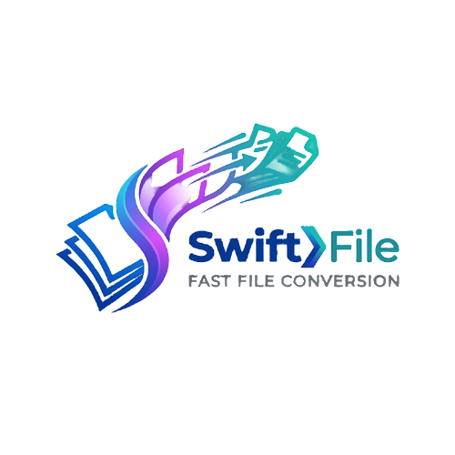

# 🚀 Swift File Convertor

**Swift File Convertor** is a modern, high-performance, and privacy-first web application for all your PDF and Image processing needs. Built with a premium glassmorphism aesthetic, it allows you to handle sensitive documents entirely within your browser—no data ever leaves your device.



## ✨ Core Features

### 📄 PDF Tools
- **Merge PDF**: Combine multiple PDF documents into a single file.
- **Split PDF**: Extract specific pages or split a PDF into individual files.
- **Compress PDF**: Optimize PDF file size while maintaining quality.
- **Unlock PDF**: Remove passwords and restrictions from protected PDF files.
- **Protect PDF**: Secure your documents with professional RC4 encryption.
- **PDF to Image**: High-fidelity conversion of PDF pages into JPG/PNG images.

### 🖼️ Image Tools
- **Image to PDF**: Convert photos (JPG, PNG, WebP, etc.) into professional PDF documents.
- **Compress Image**: Intelligent compression for images with live quality control.
- **Background Remover**:
  - **Pro AI (Cloud)**: Ultra-precise removal for complex subjects.
  - **Swift Engine (Local)**: Fast, browser-based AI removal for maximum privacy.
- **Collage Maker**: 
  - 10+ Artistic Layouts (Hero, Mosaic, Triptych, etc.).
  - Real-time interactive zoom and framing.
  - Customizable spacing, roundness, and background.

## 🛡️ Privacy & Security
Unlike traditional online converters, **Swift File Convertor** performs all processing locally on your machine using JavaScript. 
- **Zero Server Uploads**: Your files are never sent to a server.
- **Browser-Based**: All AI models and PDF engines run in your browser's sandbox.
- **Offline Capable**: Works without an internet connection once loaded.

## 🛠️ Technology Stack
- **PDF Processing**: [pdf-lib](https://github.com/Hopding/pdf-lib), [pdf.js](https://github.com/mozilla/pdf.js)
- **Document Generation**: [jsPDF](https://github.com/parallax/jsPDF)
- **AI Background Removal**: [@imgly/background-removal](https://github.com/imgly/background-removal-js)
- **UI & Icons**: [Lucide Icons](https://lucide.dev/), CSS3 Glassmorphism
- **Image Manipulation**: [Cropper.js](https://github.com/fengyuanchen/cropperjs)

## 🚀 Getting Started
1. Clone the repository:
   ```bash
   git clone https://github.com/your-username/swift-convert.git
   ```
2. Open `index.html` in any modern web browser (Chrome, Firefox, Edge, Safari).
3. Start processing your files!

## 📱 Mobile Support
Swift File Convertor is fully optimized for mobile devices. The responsive interface adapts to phone and tablet screens, allowing you to convert and edit documents on the go.

## 📄 License
This project is licensed under the MIT License - see the LICENSE file for details.

---
*Built with ❤️ for a faster, more secure web.*
